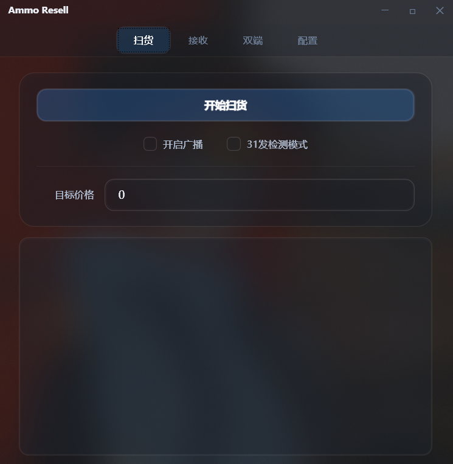
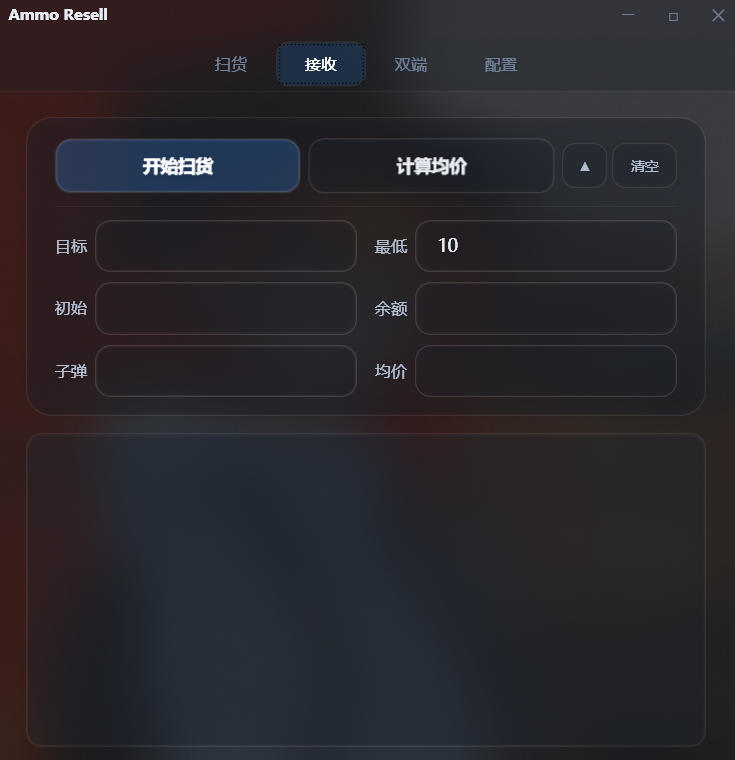
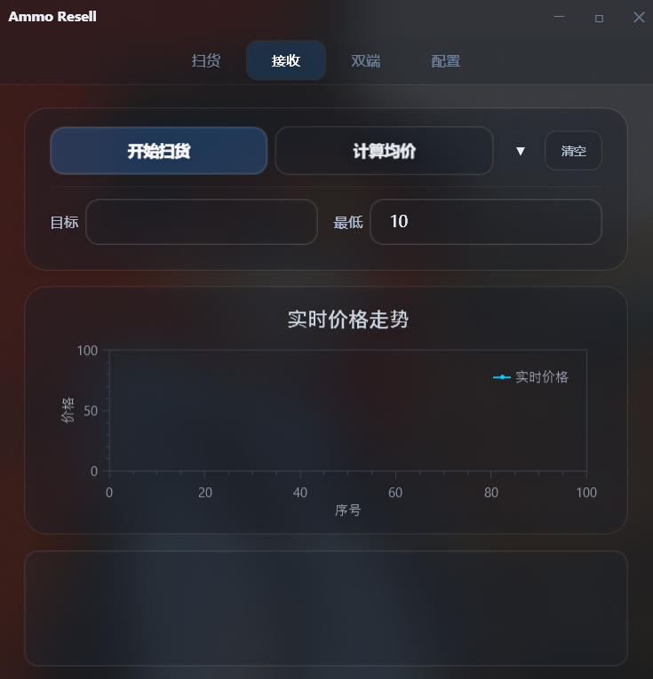
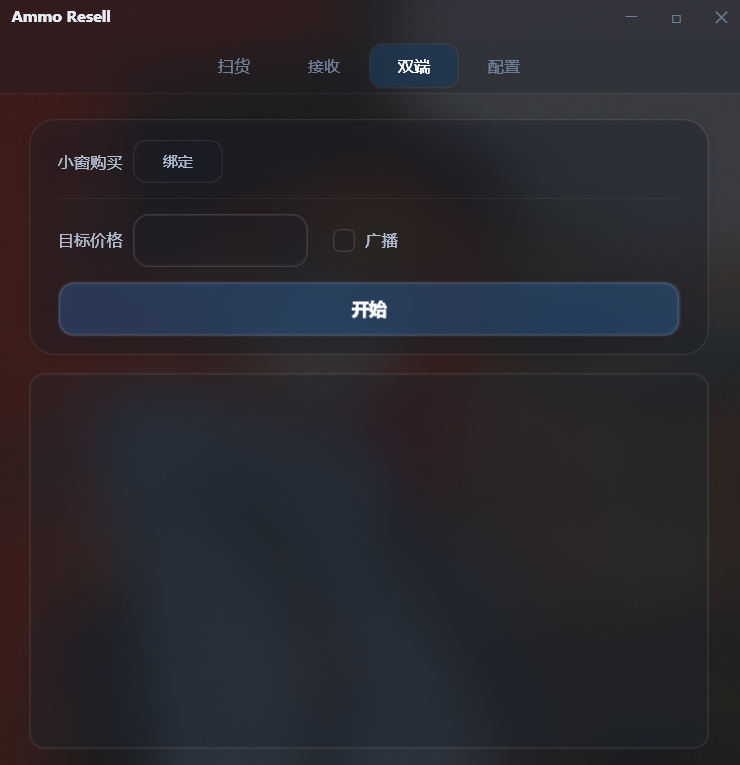
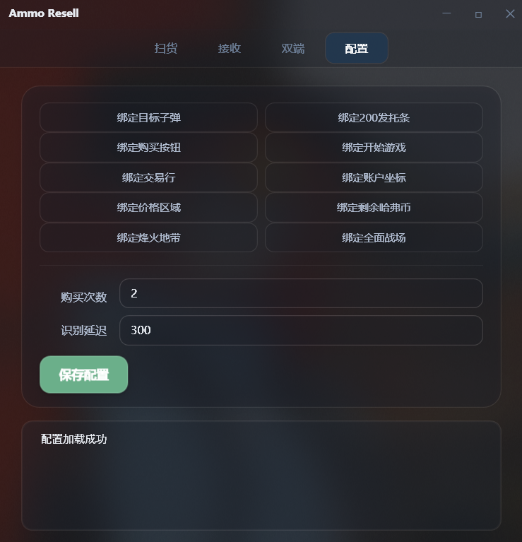

# AmmoResellScript

基于 WPF (.NET 8.0) 的桌面自动化交易工具，使用 PaddleOCR 实时识别屏幕价格，支持自动购买、局域网价格广播与双端协同操作。

## 功能

- **自动购买 (扫货)** — OCR 实时识别游戏内商品价格，低于目标价自动点击购买，支持 31 发检测模式
- **UDP 接收 (接收)** — 监听局域网内其他实例广播的价格，联动触发购买，含实时价格走势折线图与价格区间筛选
- **双端协同 (双端)** — 大窗口 31 发检测 + Alt+Tab 切换小窗口购买，自动计算单发均价
- **可视化配置 (配置)** — 图形化配置屏幕坐标区域，支持点击取样绑定

---

<p align="center">
  <a href="https://space.bilibili.com/502724171?spm_id_from=333.1007.0.0">
    
  </a>
</p>

---

<p align="center">
  <br/>
  需要打包好直接运行的软件包，可以来闲鱼请我喝杯奶茶 ☕
</p>

---

## 软件截图

### 扫货



### 接收

| 折叠模式 | 图表模式 |
|:---:|:---:|
|  |  |

### 双端



### 配置



## 技术栈

| 组件 | 说明 |
|------|------|
| .NET 8.0 + WPF | 桌面框架 |
| CommunityToolkit.Mvvm | MVVM 架构 |
| OxyPlot.Wpf | 实时折线图 |
| Sdcb.PaddleOCR | 本地 OCR 文字识别 |
| OpenCvSharp4 | 图像预处理 |
| Microsoft.Extensions.DependencyInjection | 依赖注入 |

## 环境要求

- Windows 10 1803+ 或 Windows 11
- .NET 8.0 Desktop Runtime
- x64 架构

## 快速开始

```bash
# 克隆仓库
git clone https://github.com/your-username/AmmoResellScript.git

# 还原依赖
dotnet restore

# 编译运行
管理员运行vs后启动脚本，配置教学请关注印第安美人鱼
```

## 项目结构

```
AmmoResellScript/
├── App.xaml.cs                   # 应用入口，DI 容器初始化
├── MainWindow.xaml.cs            # 主窗口，Acrylic 模糊与自定义标题栏
├── MainWindowViewModel.cs        # 主窗口 ViewModel，导航控制
├── AssemblyInfo.cs               # 程序集信息
├── Model/
│   ├── UserModel.cs              # 用户配置数据模型
│   └── PriceDataPoint.cs         # 价格历史数据点
├── ViewModels/
│   ├── AutoBuyViewModel.cs       # 自动购买逻辑（含 31 发检测）
│   ├── ReceiveViewModel.cs       # UDP 接收逻辑 + 实时图表
│   ├── DualEndViewModel.cs       # 双端协同逻辑
│   └── SettingViewModel.cs       # 配置界面逻辑
├── Views/
│   ├── AutoBuyView.xaml.cs       # 自动购买视图
│   ├── ReceiveView.xaml.cs       # 接收视图（含 OxyPlot 图表）
│   ├── DualEndView.xaml.cs       # 双端视图
│   └── SettingView.xaml.cs       # 配置视图
├── Services/
│   ├── ConfigService.cs          # 配置文件读写服务
│   ├── FastKeyboard.cs           # 键盘模拟服务
│   ├── MouseService.cs           # 鼠标模拟 + 窗口管理 + Alt+Tab
│   ├── ScreenOcrHelper.cs        # 屏幕 OCR 识别（PaddleOCR）
│   └── UdpBroadcastService.cs    # UDP 广播服务
├── UserControls/
│   └── Navigation.xaml.cs        # 导航栏控件
├── Helpers/
│   └── TextBoxHelper.cs          # 文本框辅助工具
├── Resources/
│   └── Theme.xaml                # 全局样式与主题
├── Properties/                   # 项目属性
└── images/                       # 截图资源
```

## 操作说明

| 操作 | 说明 |
|------|------|
| 按 `R` 键 | 紧急停止当前页面的自动购买 / 监听循环 |
| 扫货页 | 设置目标价格，低于目标价自动点击购买 |
| 接收页 | 监听 UDP 广播价格，支持价格区间过滤，实时折线图展示价格走势 |
| 双端页 | 先绑定小窗购买坐标，启动后自动在大窗检测 31 发均价，达标则 Alt+Tab 切小窗购买 |
| 配置页 | 点击按钮后用鼠标在游戏画面上取样坐标 |

## 注意事项

- 首次运行时会自动下载 PaddleOCR 识别模型
- 使用前需在配置页面设置各项屏幕坐标
- 双端模式下脚本窗口会自动最小化并取消置顶
- 仅用于学习交流，请勿用于违规操作
